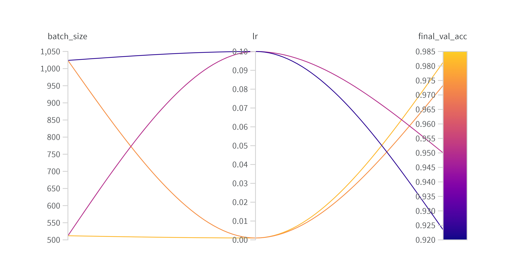
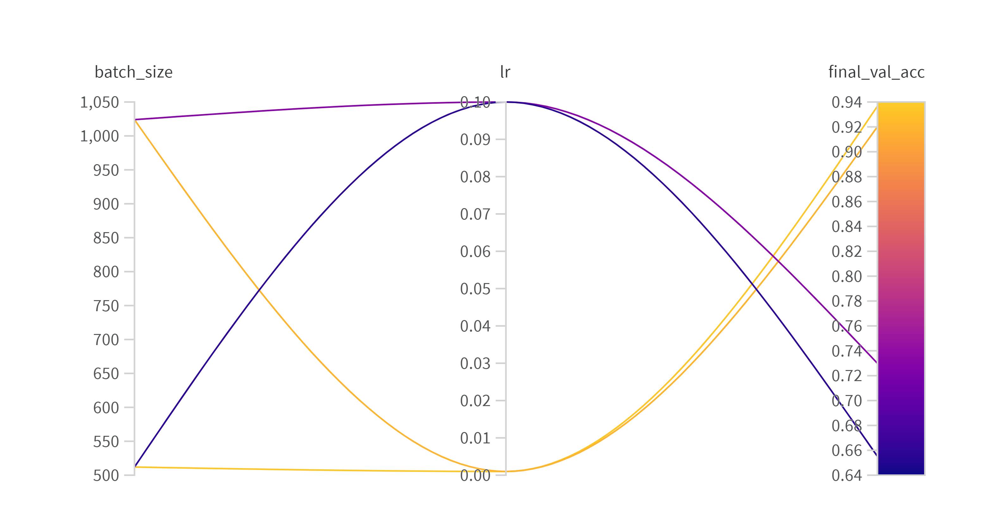
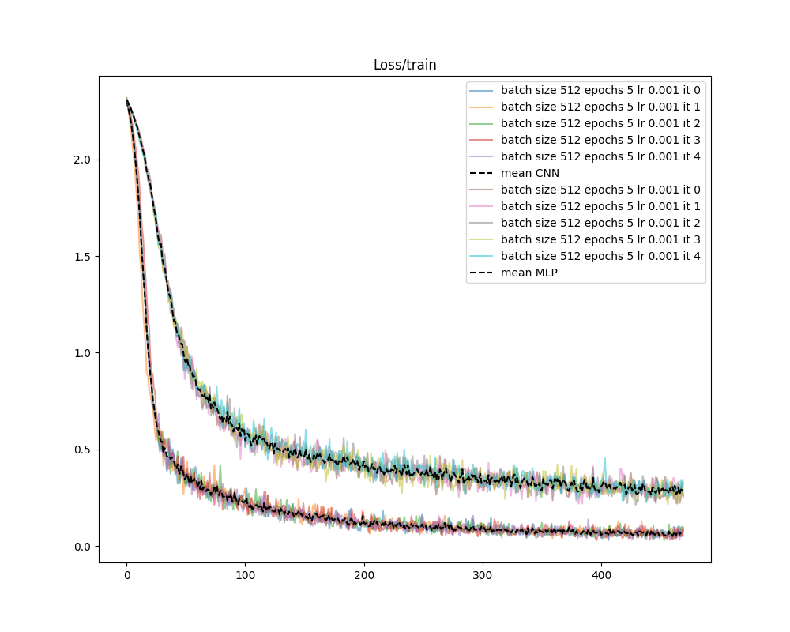
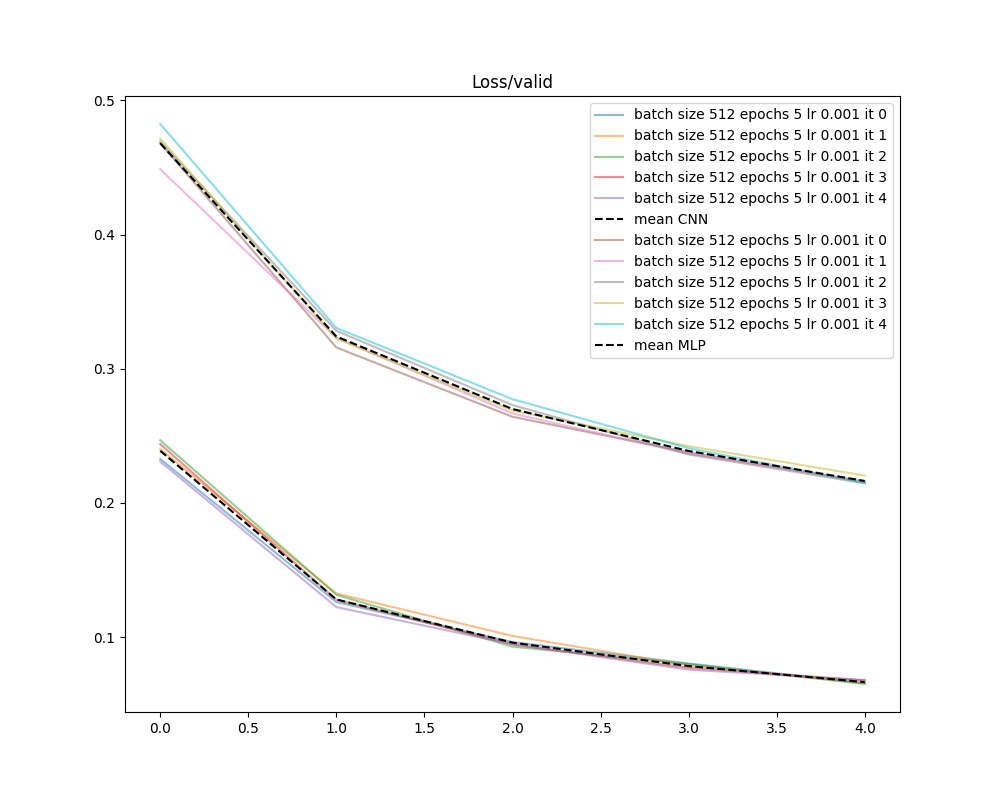

# PyTorch & Wandb: hyperparameter search and model comparison with MNIST

This repository illustrates how to perform hyperparameter search and multi-trial training with [PyTorch](https://pytorch.org/) and [wandb](https://docs.wandb.ai/guides) and the [MNIST database](https://en.wikipedia.org/wiki/MNIST_database).

It is structured around the following steps:
1. A hyperparameter grid search is performed with wandb to find the optimal configurations of two architectures (MLP and CNN).
2. Once the best configuration is identified for each model, each of them is trained 5 times in its optimal configuration.
3. Plotting scripts are finally used to extract the relevant plots and a performance summary of the multi-trial executions.

**Notes**: 
- this repository was designed to lay the foundation of a similar work involving LLMs where each architecture is handled with its own configuration file,
- in order to visualize results with wandb, you will need to sign up on [their website](https://wandb.ai/site).

## Requirements

The experiments were performed on a local laptop without GPU. In addition, Python version 3.10.12 and the dependencies in [requirements.txt](./requirements.txt) were used. These can be installed in a virtual environment with the following commands:
```sh
python3 -m venv .venv
source .venv/bin/activate
python3 -m pip install upgrade pip
pip install -r requirements.txt
```

**Note**: our experiments were conducted with the exact package versions specified in `requirements.txt`. Future updates may alter reproducibility. 

After successful installation, the user can be prompted with the program arguments:
```sh
python3 main.py --help
usage: main.py [-h] [--batch-size BATCH_SIZE] [--config CONFIG] [--epochs EPOCHS] [--json] [--lr LR] [--model MODEL]
               [--test] [--train] [--out-dir OUT_DIR] [--seed SEED] [--wandb]

options:
  -h, --help            show this help message and exit
  --batch-size BATCH_SIZE
                        batch size for train loop. (default: 512)
  --config CONFIG       name of the experiment config file. (default: config.json)
  --epochs EPOCHS       number of epochs to train on. (default: 10)
  --json                use a json config file. (default: False)
  --lr LR               learning rate. (default: 0.001)
  --model MODEL         model to train/execute: CNN or MLP. (default: CNN)
  --test                to test. (default: False)
  --train               to train. (default: False)
  --out-dir OUT_DIR     where output data are written. (default: experiment-YYYYMMDDTHHMMSS)
  --seed SEED           torch manual seed. (default: 123)
  --wandb               use a wandb config file. (default: False)
```

A simple training/test can finally be executed with the default options by running:
```sh
python3 --train --test
```

## Experiments

### Hyperparameter search

The hyperparameter search leading to the results below can be reproduced as follows:
```sh
python3 --wandb --config=wandb_config
```

**Note**: hints on how to customize the configuration file are available on the [wandb documentation](https://docs.wandb.ai/tutorials/sweeps).

The results of this search are illustrated on the figures and table below (left CNN, right MLP):

<p float="left">
  
  
</p>

|Model|lr|batch-size|epochs|validation loss [Accuracy]|
|---|---|---|---|---|
|CNN|1e-3|512|5|0.06561 [0.9813]|
|CNN|1e-3|1024|5|0.09156 [0.9733]|
|CNN|1e-1|512|5|0.1579 [0.95]|
|CNN|1e-1|1024|5|0.2435 [0.9235]|
|MLP|1e-3|512|5|0.2116 [0.9367]|
|MLP|1e-3|1024|5|0.2645 [0.9202]|
|MLP|1e-1|512|5|0.9584 [0.6551]|
|MLP|1e-1|1024|5|0.8177 [0.7299]|

**Note**: for both architectures, the hyperparameter search was performed with the same parameters. However, this is not a requirements and architectural parameter changes (e.g. in the layer depth or size) could easily be handled since model has its own set of parameters (see [wandb_config.json](./wandb_config.json)). Be aware though that introducing new parameters would require to add the corresponding parameter management code to [main.py](./main.py).

### Multi-trial training

The previous results suggest that for each model, the best configuration is:
- CNN with `lr=1e-3`, `batch_size=512`,
- MLP with `lr=1e-3`, `batch_size=512`.

Each of them was therefore trained 5 additional times by running:
```sh
python3 main.py --json --config=config
```

The results can be viewed with tensorboard with the command:
```sh
tensorboard --logdir multi-trial
```

**Note**: similarly to the hyperparameter sweep, the multi-trial configuration can easily be modified according to the user's needs (see [config.json](./config.json)). Be aware though that introducing new parameters would require to add the corresponding parameter management code to [main.py](./main.py).

### Results export

The point of running training multiple time is to extract performance statistics like the mean and standard deviations. The loss histories of the multi-trial runs are given in the figures below: 

<p float="left">
  
   
</p>

The final performances are summarized in the following table, where the means of the test loss and accuracy are given ± one standard deviation:

|Model|test loss|test accuracy|
|---|---|---|
|CNN|0.0571 ± 0.0015 |0.982 ± 0.0009|
|MLP|0.2126 ± 0.0024 |0.938 ± 0.0017|

### About reproducibility

The code was built in order to foster reproducibility by manually setting torch's seed. However, as explained on [Pytorch's documentation](https://pytorch.org/docs/stable/notes/randomness.html):
> Completely reproducible results are not guaranteed across PyTorch releases, individual commits, or different platforms. Furthermore, results may not be reproducible between CPU and GPU executions, even when using identical seeds.

In other words, users may not be able to reproduce exactly our results but provided that they run multiple experiments in the same environment (i.e. with the same dependencies and hardware), they should be able to reproduce their results.
